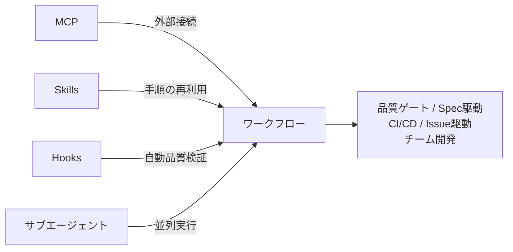

# 第15章: プロジェクトワークフロー

`CLAUDE.md`、MCP、Skills、サブエージェント、Hooksを統合して、プロジェクト全体の開発ワークフローを構築します。品質ゲート、Spec駆動開発、CI/CD、Issue駆動開発、チーム開発の5パターンを紹介します。



## レシピ一覧

| # | レシピ | 説明 |
|---|--------|------|
| 91 | [MCP+Skills+Hooksで作る品質ゲートパイプライン](./recipe-91-quality-gate/) | 生成→評価→改善の自動反復パイプラインを構築する |
| 92 | [Spec駆動開発ワークフロー](./recipe-92-spec-driven/) | 仕様→設計→実装→テストの4フェーズをSkillsで管理する |
| 93 | [CI/CDパイプラインにClaude Codeを組み込む](./recipe-93-ci-cd/) | GitHub Actionsでレビュー・Issue対応を自動化する |
| 94 | [Issue駆動開発ワークフローを構築する](./recipe-94-issue-driven/) | IssueからPR作成までを一気通貫で処理する |
| 95 | [マルチセッション・チーム開発パターン](./recipe-95-multi-session/) | Git Worktree・セッション管理・共有設定でチーム開発する |

## 使い方

```bash
# 例: 品質ゲートパイプラインのSkillsをコピー
cp -r recipe-91-quality-gate/.claude /path/to/your-project/

# 例: CI/CDワークフローをコピー
cp recipe-93-ci-cd/.github/workflows/claude.yml /path/to/your-project/.github/workflows/

# 例: Issue駆動開発Skillsをコピー
cp -r recipe-94-issue-driven/.claude /path/to/your-project/
```

各レシピはMCP、Skills、Hooksの基本知識（第2部〜第5部）を前提としています。
