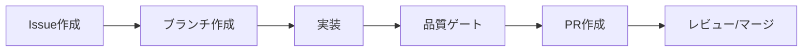

# 第15章: プロジェクトワークフロー

MCP、Skills、サブエージェント、Hooksを統合したプロジェクト全体の開発ワークフローを構築します。

## レシピ一覧（5件）

| # | レシピ | 難易度 | 説明 |
|---|--------|--------|------|
| 91 | [MCP+Skills+Hooksで作る品質ゲートパイプライン](./recipe-91/) | ★★★ | 生成→評価→改善の自動反復パイプライン |
| 92 | [Spec駆動開発ワークフロー](./recipe-92/) | ★★★ | 仕様→設計→実装→テストの4フェーズをPlan Modeで管理 |
| 93 | [CI/CDパイプラインにClaude Codeを組み込む](./recipe-93/) | ★★★ | GitHub ActionsでPRレビュー・Issue対応を自動化 |
| 94 | [Issue駆動開発ワークフローを構築する](./recipe-94/) | ★★☆ | Issue→ブランチ→実装→PRの一連フローを効率化 |
| 95 | [マルチセッション・チーム開発パターン](./recipe-95/) | ★★★ | Git Worktree、セッション管理、チーム共有設定 |

## 前提条件

- Claude Code: 最新版
- Node.js: 20+
- GitHub CLI: `gh`コマンド（CI/CD連携時）

## クイックスタート

```bash
# 品質ゲートSkillsの実行
claude
> /quality-gate
```

## ワークフロー概念図


```mermaid
graph LR
    A[Issue作成] --> B[ブランチ作成]
    B --> C[実装]
    C --> D[品質ゲート]
    D --> E[PR作成]
    E --> F[レビュー/マージ]
```

## 備考

- 第2部〜第5部の基本知識を前提としています
- 詳しい解説は書籍本文を参照してください
